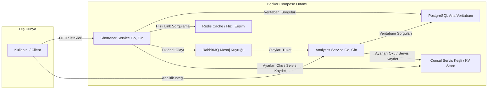

# Go ile Mikroservis URL Kısaltma Projesi

Bu proje, Go dili kullanılarak geliştirilmiş, kullanıcı hesapları, tıklama analitiği ve etiketleme gibi özellikler içeren modern bir mikroservis mimarisine sahip URL kısaltma uygulamasıdır. Tüm sistem, Docker, Docker Compose ve Consul kullanılarak konteynerize edilmiştir ve tek bir komutla çalıştırılabilir.

## Mimari Şeması

Sistem, görevleri ayrılmış iki ana mikroservis, asenkron iletişim için bir mesaj kuyruğu, merkezi yapılandırma/servis keşfi ve farklı amaçlar için kullanılan iki ayrı veritabanından oluşur.



## ⭐ Özellikler

- **Kullanıcı Yönetimi:** Güvenli parola hash'leme (`bcrypt`) ile kullanıcı kaydı ve JWT (JSON Web Token) tabanlı giriş sistemi.
- **Gelişmiş Link Yönetimi:**
    - Giriş yapmış kullanıcılar için link oluşturma ve listeleme.
    - Hem rastgele hem de kullanıcı tanımlı **özel kısa linkler** oluşturma.
    - Linkleri daha iyi organize etmek için **etiketleme (tagging)** özelliği.
- **Asenkron Analitik:** Tıklama olayları, ana yönlendirme işlemini yavaşlatmamak için RabbitMQ üzerinden asenkron olarak işlenir.
- **Analitik API:** Her bir link için toplam tıklanma sayısı gibi istatistikleri sunan bir API.
- **QR Kod Üretimi:** Her kısa link için anında QR kod üreten bir endpoint.
- **Merkezi Yönetim:** Consul ile servis keşfi ve merkezi yapılandırma yönetimi.
- **Konteynerizasyon:** Tüm proje, Docker ve Docker Compose ile paketlenmiştir, bu da geliştirme ve dağıtım süreçlerini basitleştirir.

## 🛠️ Kullanılan Teknolojiler

- **Backend:** Go, Gin Web Framework
- **Veritabanları:**
    - **PostgreSQL:** Kullanıcılar, linkler, etiketler ve analitik verileri için kalıcı ana veritabanı.
    - **Redis:** Yüksek hızlı yönlendirme ve çakışma kontrolü için önbellek (cache).
- **Mesajlaşma:** RabbitMQ (Servisler arası asenkron iletişim).
- **Servis Yönetimi:** Consul (Servis Keşfi, Merkezi Yapılandırma, Sağlık Kontrolü).
- **Kimlik Doğrulama:** JWT (JSON Web Tokens)
- **Containerization:** Docker, Docker Compose

## 🚀 Başlarken

Projeyi yerel makinenizde çalıştırmak için aşağıdaki adımları izleyin.

### Gereksinimler

- Git
- Docker
- Docker Compose

### Kurulum

1.  **Projeyi klonlayın:**
    ```sh
    git clone <proje-github-linki>
    cd url-shortener
    ```

2.  **Yapılandırma Dosyalarını Oluşturun:**
    * **Consul için:** Projenin ana dizininde `consul_config` adında bir klasör ve içinde `config.json` adında bir dosya oluşturun. İçeriği şu şekilde olmalı:
        ```json
        [
          { "key": "config/postgres/user", "value": "harunbas" },
          { "key": "config/postgres/password", "value": "12345678" },
          { "key": "config/postgres/dbname", "value": "analytics_db" },
          { "key": "config/jwt/secret", "value": "cok-guvenli-bir-anahtar" },
          { "key": "config/redis/host", "value": "redis" },
          { "key": "config/redis/port", "value": "6379" },
          { "key": "config/rabbitmq/host", "value": "rabbitmq" },
          { "key": "config/rabbitmq/port", "value": "5672" }
        ]
        ```
    * **Docker Compose için:** Projenin ana dizininde `.env` adında bir dosya oluşturun. Bu dosya, `docker-compose.yml` tarafından `postgres` servisini başlatmak için kullanılır.
        ```ini
        # PostgreSQL Ayarları
        DB_USER=harunbas
        DB_PASSWORD=12345678
        DB_NAME=analytics_db
        ```

3.  **Uygulamayı Başlatın:**
    Aşağıdaki komut, tüm servislerin imajlarını oluşturacak ve konteynerleri arka planda başlatacaktır.
    ```sh
    docker-compose up --build -d
    ```

4.  **Veritabanı Tablolarını Oluşturun:**
    Uygulama başladıktan sonra (yaklaşık 30 saniye bekleyin), kullandığınız bir veritabanı istemcisi (DBeaver, DataGrip vb.) ile `localhost:5433` adresindeki `analytics_db` veritabanına bağlanın ve aşağıdaki SQL komutlarını çalıştırarak tabloları oluşturun.

    <details>
    <summary>Tablo Oluşturma SQL Komutları</summary>

    ```sql
    -- Kullanıcıları tutmak için
    CREATE TABLE users (
        id SERIAL PRIMARY KEY,
        email VARCHAR(255) UNIQUE NOT NULL,
        password_hash VARCHAR(255) NOT NULL,
        created_at TIMESTAMP WITH TIME ZONE DEFAULT NOW()
    );

    -- Linkleri ve sahiplerini tutmak için
    CREATE TABLE links (
        id SERIAL PRIMARY KEY,
        owner_id INTEGER REFERENCES users(id) ON DELETE CASCADE,
        short_code VARCHAR(50) UNIQUE NOT NULL,
        original_url TEXT NOT NULL,
        created_at TIMESTAMP WITH TIME ZONE DEFAULT NOW()
    );

    -- Tıklama olaylarını tutmak için
    CREATE TABLE clicks (
        id SERIAL PRIMARY KEY,
        short_code VARCHAR(50) NOT NULL,
        clicked_at TIMESTAMP WITH TIME ZONE DEFAULT NOW()
    );

    -- Benzersiz etiketleri saklamak için
    CREATE TABLE tags (
        id SERIAL PRIMARY KEY,
        name VARCHAR(50) UNIQUE NOT NULL
    );

    -- Linkler ve etiketler arasındaki ilişkiyi kuran köprü tablo
    CREATE TABLE link_tags (
        link_id INTEGER NOT NULL REFERENCES links(id) ON DELETE CASCADE,
        tag_id INTEGER NOT NULL REFERENCES tags(id) ON DELETE CASCADE,
        PRIMARY KEY (link_id, tag_id)
    );
    ```
    </details>

##  API Endpoint'leri

### Herkese Açık Endpoint'ler

| Metot | Path | Açıklama |
| :--- | :--- | :--- |
| `POST` | `/register` | Yeni kullanıcı hesabı oluşturur. |
| `POST` | `/login` | Giriş yapar ve bir JWT döner. |
| `POST` | `/shorten` | Kalıcı olmayan, anonim bir kısa link oluşturur (Sadece Redis'e yazar). |
| `GET` | `/qr/:shortCode` | Belirtilen kısa link için bir QR kod resmi döner. |
| `GET` | `/:shortCode` | Kısa linki orijinal adresine yönlendirir. |

### Korumalı Endpoint'ler
*Bu endpoint'leri kullanmak için `Authorization: Bearer <TOKEN>` header'ı gereklidir.*

| Metot | Path | Açıklama |
| :--- | :--- | :--- |
| `POST` | `/links` | Giriş yapmış kullanıcı için kalıcı ve etiketli yeni bir kısa link oluşturur. |
| `GET` | `/links` | Giriş yapmış kullanıcının tüm linklerini etiketleriyle birlikte listeler. `?tag=...` parametresi ile filtreleme yapılabilir. |
| `GET` | `/analytics/:shortCode` | Belirtilen kısa link için tıklanma istatistiklerini döner. |

## 📖 Kullanım ve Test Senaryosu

Aşağıdaki adımlar, sistemin tüm ana işlevlerini test etmenizi sağlayan baştan sona bir kullanım senaryosudur. Komutları terminalinizde sırasıyla çalıştırabilirsiniz.

**1. Yeni Bir Kullanıcı Kaydedin**

```sh
curl -X POST http://localhost:8080/register \
-H "Content-Type: application/json" \
-d '{"email": "kullanici@example.com", "password": "guvenlisifre123"}'
```

**2. Giriş Yapın ve Erişim Token'ı Alın**
(`jq` kurulu olmalıdır).
```sh
TOKEN=$(curl -s -X POST http://localhost:8080/login \
  -H "Content-Type: application/json" \
  -d '{"email": "kullanici@example.com", "password": "guvenlisifre123"}' | jq -r .token)
```

**3. Korumalı Endpoint ile Etiketli Bir Link Oluşturun**
```sh
curl -X POST http://localhost:8080/links \
-H "Authorization: Bearer $TOKEN" \
-H "Content-Type: application/json" \
-d '{"url": "[https://github.com/hashicorp/consul](https://github.com/hashicorp/consul)", "custom_short": "consul-projesi", "tags": ["devops", "consul"]}'
```

**4. Linklerinizi Listeleyin ve Etiketleri Görün**
```sh
curl -X GET http://localhost:8080/links \
-H "Authorization: Bearer $TOKEN"
```

**5. Yönlendirmeyi ve Analitiği Test Edin**
Tarayıcınızda `http://localhost:8080/consul-projesi` adresine gidin.

**6. Tıklama Verisini Kontrol Edin**
```sh
curl http://localhost:8081/analytics/consul-projesi
```

**7. QR Kodu Görüntüleyin**
Tarayıcınızda `http://localhost:8080/qr/consul-projesi` adresine gidin.