# Go ile Mikroservis URL Kısaltma Projesi

Bu proje, Go dili kullanılarak geliştirilmiş, kullanıcı hesapları, tıklama analitiği ve etiketleme gibi özellikler içeren modern ve dayanıklı bir mikroservis mimarisine sahip URL kısaltma uygulamasıdır. Tüm sistem, Docker, Docker Compose ve Consul kullanılarak konteynerize edilmiştir ve tek bir komutla çalıştırılabilir.

## Mimari Şeması

Sistem, görevleri ayrılmış iki ana mikroservis, asenkron ve güvenilir iletişim için bir mesaj kuyruğu, merkezi yapılandırma/servis keşfi ve farklı amaçlar için kullanılan iki ayrı veritabanından oluşur.

```mermaid
graph LR
    subgraph "Dış Dünya"
        User[Kullanıcı / Client]
    end

    subgraph "Docker Compose Ortamı"
        Shortener[Shortener Service API Gateway]
        Analytics[Analytics Service Asenkron İşçi]
        RabbitMQ[RabbitMQ Dayanıklı Mesajlaşma]
        Postgres[PostgreSQL Tek Doğruluk Kaynağı]
        Redis[Redis Önbellek Katmanı]
        Consul[Consul Servis Keşfi / KV Store]

        User -- HTTP API İstekleri --> Shortener
        User -- Analitik API --> Analytics

        Shortener -- Kalıcı Kayıt Oku/Yaz --> Postgres
        Shortener -- Hızlı Erişim İçin Önbellek --> Redis
        Shortener -- "Tıklandı" Olayı (Kalıcı Mesaj) --> RabbitMQ
        Shortener -- Ayarları Oku / Servis Kaydet --> Consul

        RabbitMQ -- Mesajları Güvenli Tüket (Ack/Nack) --> Analytics
        Analytics -- Veritabanı Yaz/Oku --> Postgres
        Analytics -- Ayarları Oku / Servis Kaydet --> Consul
    end
```



## ⭐ Özellikler

- **Kullanıcı Yönetimi:** Güvenli parola hash'leme (`bcrypt`) ile kullanıcı kaydı ve JWT (JSON Web Token) tabanlı giriş sistemi.
- **Gelişmiş Link Yönetimi:**
    - Giriş yapmış kullanıcılar için kalıcı link oluşturma ve listeleme.
    - Hem rastgele hem de kullanıcı tanımlı **özel kısa linkler** oluşturma.
    - Linkleri daha iyi organize etmek için **etiketleme (tagging)** özelliği.
- **Dayanıklılık ve Güvenilirlik:**
    - **Tek Doğruluk Kaynağı:** Tüm linkler (anonim veya değil) kalıcı olarak PostgreSQL'de saklanır, Redis sadece bir önbellek katmanıdır.
    - **Kalıcı Mesajlaşma:** RabbitMQ sunucusu yeniden başlasa bile tıklama mesajları kaybolmaz.
    - **Güvenli Mesaj İşleme:** Tüketici servis (`analytics-service`) bir mesajı işlerken hata alırsa, mesaj kaybolmaz ve daha sonra yeniden denenmek üzere kuyruğa geri eklenir (Manual Ack/Nack).
    - **Mükerrer Kayıt Engelleme (Idempotency):** Aynı tıklama mesajı birden fazla kez gelse bile veritabanına sadece tek bir kayıt atılır.
    - **Graceful Shutdown:** Servisler, kapanma sinyali aldıklarında mevcut işlemleri bitirerek ve bağlantıları temizleyerek "kibarca" kapanır.
- **Asenkron Analitik:** Tıklama olayları, RabbitMQ üzerinden asenkron olarak işlenir.
- **Analitik API:** Her bir link için tıklanma istatistiklerini sunan bir API.
- **QR Kod Üretimi:** Her kısa link için anında QR kod üreten bir endpoint.
- **Merkezi Yönetim:** Consul ile servis keşfi ve dinamik yapılandırma yönetimi.
- **Konteynerizasyon:** Tüm proje, Docker ve Docker Compose ile paketlenmiştir.

## 🛠️ Kullanılan Teknolojiler

- **Backend:** Go, Gin Web Framework
- **Veritabanları:**
    - **PostgreSQL:** Kullanıcılar, linkler, etiketler ve analitik verileri için kalıcı ana veritabanı.
    - **Redis:** Yüksek hızlı yönlendirme için önbellek (cache).
- **Mesajlaşma:** RabbitMQ
- **Servis Yönetimi:** Consul
- **Kimlik Doğrulama:** JWT
- **Containerization:** Docker, Docker Compose

## 🚀 Başlarken

### Gereksinimler

- Git
- Docker
- Docker Compose

### Kurulum

1.  **Projeyi klonlayın:**
    ```sh
    git clone <proje-github-linki>
    cd url-shortener
    ```

2.  **Yapılandırma Dosyalarını Oluşturun:**
    * **Consul için:** Projenin ana dizininde `consul_config` adında bir klasör ve içinde `config.json` adında bir dosya oluşturun. İçeriği şu şekilde olmalı:
        ```json
        [
          { "key": "config/postgres/user", "value": "harunbas" },
          { "key": "config/postgres/password", "value": "12345678" },
          { "key": "config/postgres/dbname", "value": "analytics_db" },
          { "key": "config/jwt/secret", "value": "cok-guvenli-bir-anahtar" },
          { "key": "config/redis/host", "value": "redis" },
          { "key": "config/redis/port", "value": "6379" },
          { "key": "config/rabbitmq/host", "value": "rabbitmq" },
          { "key": "config/rabbitmq/port", "value": "5672" }
        ]
        ```
    * **Docker Compose için:** Projenin ana dizininde `.env` adında bir dosya oluşturun. Bu dosya, `docker-compose.yml` tarafından `postgres` servisini başlatmak için kullanılır.
        ```ini
        # PostgreSQL Ayarları
        DB_USER=harunbas
        DB_PASSWORD=12345678
        DB_NAME=analytics_db
        ```

3.  **Uygulamayı Başlatın:**
    ```sh
    docker-compose up --build -d
    ```

4.  **Veritabanı Tablolarını Oluşturun:**
    Uygulama başladıktan sonra (yaklaşık 30 saniye bekleyin), bir veritabanı istemcisi ile `localhost:5433` adresindeki `analytics_db` veritabanına bağlanın ve aşağıdaki SQL komutlarını çalıştırın.

    <details>
    <summary>Tablo Oluşturma SQL Komutları</summary>

    ```sql
    -- Kullanıcıları tutmak için
    CREATE TABLE users (
        id SERIAL PRIMARY KEY,
        email VARCHAR(255) UNIQUE NOT NULL,
        password_hash VARCHAR(255) NOT NULL,
        created_at TIMESTAMP WITH TIME ZONE DEFAULT NOW()
    );

    -- Linkleri ve sahiplerini tutmak için
    CREATE TABLE links (
        id SERIAL PRIMARY KEY,
        owner_id INTEGER REFERENCES users(id) ON DELETE CASCADE,
        short_code VARCHAR(50) UNIQUE NOT NULL,
        original_url TEXT NOT NULL,
        created_at TIMESTAMP WITH TIME ZONE DEFAULT NOW()
    );

    -- Tıklama olaylarını tutmak için
    CREATE TABLE clicks (
        id SERIAL PRIMARY KEY,
        short_code VARCHAR(50) NOT NULL,
        message_id VARCHAR(36) UNIQUE, -- Mükerrer kayıt engelleme için
        clicked_at TIMESTAMP WITH TIME ZONE DEFAULT NOW()
    );

    -- Benzersiz etiketleri saklamak için
    CREATE TABLE tags (
        id SERIAL PRIMARY KEY,
        name VARCHAR(50) UNIQUE NOT NULL
    );

    -- Linkler ve etiketler arasındaki ilişkiyi kuran köprü tablo
    CREATE TABLE link_tags (
        link_id INTEGER NOT NULL REFERENCES links(id) ON DELETE CASCADE,
        tag_id INTEGER NOT NULL REFERENCES tags(id) ON DELETE CASCADE,
        PRIMARY KEY (link_id, tag_id)
    );
    ```
    </details>

##  API Endpoint'leri

### Herkese Açık Endpoint'ler

| Metot | Path | Açıklama |
| :--- | :--- | :--- |
| `POST` | `/register` | Yeni kullanıcı hesabı oluşturur. |
| `POST` | `/login` | Giriş yapar ve bir JWT döner. |
| `POST` | `/shorten` | Kalıcı ve anonim bir kısa link oluşturur (PostgreSQL'e yazar). |
| `GET` | `/qr/:shortCode` | Belirtilen kısa link için bir QR kod resmi döner. |
| `GET` | `/:shortCode` | Kısa linki orijinal adresine yönlendirir. |

### Korumalı Endpoint'ler
*Bu endpoint'leri kullanmak için `Authorization: Bearer <TOKEN>` header'ı gereklidir.*

| Metot | Path | Açıklama |
| :--- | :--- | :--- |
| `POST` | `/links` | Giriş yapmış kullanıcı için kalıcı ve etiketli yeni bir kısa link oluşturur. |
| `GET` | `/links` | Giriş yapmış kullanıcının tüm linklerini etiketleriyle birlikte listeler. `?tag=marketing` gibi bir parametre ile filtreleme yapılabilir. |
| `GET` | `/analytics/:shortCode` | Belirtilen kısa link için tıklanma istatistiklerini döner. |

## 📖 Kullanım ve Test Senaryosu

Aşağıdaki adımlar, sistemin tüm ana işlevlerini test etmenizi sağlayan baştan sona bir kullanım senaryosudur.

**1. Yeni Bir Kullanıcı Kaydedin**
```sh
curl -X POST http://localhost:8080/register \
-H "Content-Type: application/json" \
-d '{"email": "kullanici@example.com", "password": "guvenlisifre123"}'
```
**2. Giriş Yapın ve Erişim Token'ı Alın**
(`jq` kurulu olmalıdır).
```sh
TOKEN=$(curl -s -X POST http://localhost:8080/login \
  -H "Content-Type: application/json" \
  -d '{"email": "kullanici@example.com", "password": "guvenlisifre123"}' | jq -r .token)
```
**3. Korumalı Endpoint ile Etiketli Bir Link Oluşturun**
```sh
curl -X POST http://localhost:8080/links \
-H "Authorization: Bearer $TOKEN" \
-H "Content-Type: application/json" \
-d '{"url": "[https://github.com/hashicorp/consul](https://github.com/hashicorp/consul)", "custom_short": "consul-projesi", "tags": ["devops", "consul"]}'
```
**4. Linklerinizi Listeleyin ve Etiketleri Görün**
```sh
curl -X GET http://localhost:8080/links \
-H "Authorization: Bearer $TOKEN"
```
**5. Yönlendirmeyi ve Analitiği Test Edin**
Tarayıcınızda `http://localhost:8080/consul-projesi` adresine gidin.

**6. Tıklama Verisini Kontrol Edin**
```sh
curl http://localhost:8081/analytics/consul-projesi
```
**7. QR Kodu Görüntüleyin**
Tarayıcınızda `http://localhost:8080/qr/consul-projesi` adresine gidin.

**8. Anonim Link Oluşturma**
```sh
curl -X POST http://localhost:8080/shorten \
-H "Content-Type: application/json" \
-d '{"url": "https://redis.io/", "custom_short": "redis-sitesi"}'
```